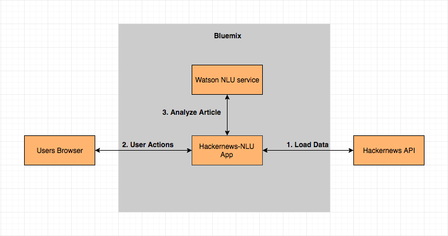

[](https://travis-ci.org/IBM/Hackernews-NLU)

# Hackernews-NLU

Hackernews-NLU is a sample application that uses Watson Natural Language Understanding service to analyze the contents of trending news articles on Hackernews to give information about the concepts, entities, categories, keywords, sentiment, emotion etc. about the news article.

## Application Workflow Diagram


* The user deploys the application to bluemix.
* Application loads the data from the Hackernews API.
* The user interacts with the application UI using their browser.
* When the user performs any action, UI calls the server application API which uses the Watson NLU service to analyze the respective news article.

## Included Components
- Bluemix Watson Natural Language Understanding service
- Hackernews API

## Deploying the Application to Bluemix

You can deploy the application using any one of the following ways:
- Deploy to Bluemix button
- Bluemix command line

### a) Using the Deploy to Bluemix button
Clicking on the button below creates a Bluemix DevOps Toolchain and deploys this application to Bluemix. The `manifest.yml` file [included in the repo] is parsed to obtain the name of the application, configuration details, and the list of services that should be provisioned. For further details on the structure of the `manifest.yml` file, see the [Cloud Foundry documentation](https://docs.cloudfoundry.org/devguide/deploy-apps/manifest.html#minimal-manifest).

[](https://bluemix.net/deploy?repository=https://github.com/IBM/Hackernews-NLU.git)

Once deployment to Bluemix is completed, you can view the deployed application and services from your bluemix account.

### b) Using the Bluemix command line
You can also manually deploy the Hackernews-NLU app to Bluemix. Though not as magical as using the Bluemix button above, manually deploying the app gives you some insights about what is happening behind the scenes. Remember that you'd need the Bluemix [command line](http://clis.ng.bluemix.net/ui/home.html) installed on your system to deploy the app to Bluemix.

Execute the following command to clone the Git repository:

```bash
git clone https://github.com/IBM/Hackernews-NLU.git
```

Go to the project's root folder on your system and execute the `Cloud-Scripts/services/services.sh` script to create the service Hackernews-NLU depends on. Please note that you should have logged on to Bluemix before attempting to execute this script. For information on how to log in, see the Bluemix [documentation](https://console.ng.bluemix.net/docs/starters/install_cli.html).

Executing the `Cloud-Scripts/services/services.sh` script should result in output similar to this:

```bash
$ Cloud-Scripts/services/services.sh
Creating service...
Invoking 'cf create-service natural-language-understanding free Hackernews-NLU'...

Creating service instance Hackernews-NLU in org ishan.gulhane@ibm.com / space dev as ishan.gulhane@ibm.com...
OK
Service created.
```

After the service is created, you can issue the `bx app push` command from the project's root folder to deploy the Swift-Enterprise-Demo application to Bluemix.

```bash
$ bx app push
Invoking 'cf push'...

Using manifest file /Users/ishan/Documents/ishan-git-demos/Hackernews-NLU/manifest.yml

Creating app HackernewsNLU in org ishan.gulhane@ibm.com / space dev as ishan.gulhane@ibm.com...
OK

Creating route hackernewsnlu-seventieth-cockiness.mybluemix.net...
OK

Binding hackernewsnlu-seventieth-cockiness.mybluemix.net to HackernewsNLU...
OK

Uploading HackernewsNLU...
Uploading app files from: /Users/ishan/Documents/ishan-git-demos/Hackernews-NLU
Uploading 237.8K, 35 files
Done uploading               
OK
Binding service Hackernews-NLU to app HackernewsNLU in org ishan.gulhane@ibm.com / space dev as ishan.gulhane@ibm.com...
OK

Starting app HackernewsNLU in org ishan.gulhane@ibm.com / space dev as ishan.gulhane@ibm.com...
Downloading swift_buildpack...
Downloaded swift_buildpack
Creating container
Successfully created container
Downloading app package...
Downloaded app package (196.3K)
Staging...
-----> Buildpack version 2.0.6
-----> Default supported Swift version is 3.1.1
-----> Configure for apt-get installs...
-----> Writing profile script...
-----> Copying deb files to installation folder...
-----> No Aptfile found.
-----> Getting swift-3.1.1
       Cached swift-3.1.1
-----> Unpacking swift-3.1.1.tar.gz
-----> Getting clang-4.0.0
       Cached clang-4.0.0
-----> Unpacking clang-4.0.0.tar.xz
-----> .ssh directory and config file not found.
-----> Skipping cache restore (new swift signature)
-----> Fetching Swift packages and parsing Package.swift files...
       Fetching https://github.com/IBM-Swift/Configuration.git
       Fetching https://github.com/IBM-Swift/CloudConfiguration.git
       Fetching https://github.com/IBM-Swift/BlueSSLService.git
       Fetching https://github.com/IBM-Swift/Swift-cfenv.git
       Fetching https://github.com/IBM-Swift/SwiftyJSON.git
       Resolving https://github.com/IBM-Swift/Kitura.git at 1.7.3
       Cloning https://github.com/IBM-Swift/BlueSignals.git
       Resolving https://github.com/IBM-Bluemix/cf-deployment-tracker-client-swift.git at 3.0.2
       Resolving https://github.com/IBM-Swift/Swift-cfenv.git at 4.0.2
       Cloning https://github.com/IBM-Swift/CloudConfiguration.git
       Fetching https://github.com/IBM-Swift/Kitura.git
       Fetching https://github.com/IBM-Swift/HeliumLogger.git
       Fetching https://github.com/IBM-Bluemix/cf-deployment-tracker-client-swift.git
       Fetching https://github.com/IBM-Swift/CCurl.git
       Fetching https://github.com/IBM-Swift/Kitura-TemplateEngine.git
       Fetching https://github.com/IBM-Swift/Kitura-net.git
       Fetching https://github.com/IBM-Swift/LoggerAPI.git
       Fetching https://github.com/IBM-Swift/BlueSocket.git
       Fetching https://github.com/IBM-Swift/CEpoll.git
       Fetching https://github.com/IBM-Swift/BlueSignals.git
       Fetching https://github.com/IBM-Swift/OpenSSL.git
       Cloning https://github.com/IBM-Swift/Kitura-net.git
       Resolving https://github.com/IBM-Swift/Kitura-net.git at 1.7.5
       Resolving https://github.com/IBM-Swift/BlueSignals.git at 0.9.47
       Cloning https://github.com/IBM-Swift/LoggerAPI.git
       Resolving https://github.com/IBM-Swift/LoggerAPI.git at 1.7.0
       Cloning https://github.com/IBM-Swift/BlueSocket.git
       Resolving https://github.com/IBM-Swift/BlueSocket.git at 0.12.47
       Cloning https://github.com/IBM-Swift/HeliumLogger.git
       Resolving https://github.com/IBM-Swift/HeliumLogger.git at 1.7.0
       Cloning https://github.com/IBM-Swift/Swift-cfenv.git
       Cloning https://github.com/IBM-Swift/Configuration.git
       Resolving https://github.com/IBM-Swift/Configuration.git at 1.0.0
       Cloning https://github.com/IBM-Swift/CEpoll.git
       Resolving https://github.com/IBM-Swift/CEpoll.git at 0.1.0
       Resolving https://github.com/IBM-Swift/CloudConfiguration.git at 2.0.1
       Cloning https://github.com/IBM-Swift/Kitura-TemplateEngine.git
       Resolving https://github.com/IBM-Swift/Kitura-TemplateEngine.git at 1.7.0
       Cloning https://github.com/IBM-Swift/CCurl.git
       Resolving https://github.com/IBM-Swift/CCurl.git at 0.2.3
       Cloning https://github.com/IBM-Swift/SwiftyJSON.git
       Resolving https://github.com/IBM-Swift/SwiftyJSON.git at 16.0.0
       Cloning https://github.com/IBM-Swift/OpenSSL.git
       Resolving https://github.com/IBM-Swift/OpenSSL.git at 0.3.5
       Cloning https://github.com/IBM-Swift/BlueSSLService.git
       Resolving https://github.com/IBM-Swift/BlueSSLService.git at 0.12.33
       Cloning https://github.com/IBM-Swift/Kitura.git
       Cloning https://github.com/IBM-Bluemix/cf-deployment-tracker-client-swift.git
-----> Additional packages to download: libcurl4-openssl-dev openssl libssl-dev
-----> libcurl4-openssl-dev is already installed.
-----> openssl is already installed.
-----> libssl-dev is already installed.
-----> No additional packages to download.
-----> Skipping installation of App Management (debug)
-----> Installing system level dependencies...
-----> Building Package...
-----> Build config: release
       Compile Swift Module 'Socket' (3 sources)
       Compile Swift Module 'SwiftyJSON' (2 sources)
       Compile Swift Module 'Signals' (1 sources)
       Compile Swift Module 'KituraTemplateEngine' (1 sources)
       Compile Swift Module 'LoggerAPI' (1 sources)
       Compile Swift Module 'Configuration' (6 sources)
       Compile Swift Module 'HeliumLogger' (2 sources)
       Compile Swift Module 'TestProgram' (1 sources)
       Compile Swift Module 'CloudFoundryEnv' (6 sources)
       Linking ./.build/release/TestProgram
       Compile Swift Module 'SSLService' (1 sources)
       Compile CHTTPParser utils.c
       Compile CHTTPParser http_parser.c
       Compile Swift Module 'CloudFoundryConfig' (2 sources)
       Linking CHTTPParser
       Compile Swift Module 'KituraNet' (34 sources)
       Compile Swift Module 'CloudFoundryDeploymentTracker' (1 sources)
       Compile Swift Module 'Kitura' (43 sources)
       Compile Swift Module 'HackernewsNLU' (3 sources)
       Linking ./.build/release/HackernewsNLU
-----> Copying dynamic libraries
-----> Copying binaries to 'bin'
-----> Clearing previous swift cache
-----> Saving cache (default):
-----> - .build
-----> Optimizing contents of cache folder...
No start command specified by buildpack or via Procfile.
App will not start unless a command is provided at runtime.
Exit status 0
Uploading droplet, build artifacts cache...
Staging complete
Uploading build artifacts cache...
Uploading droplet...
Uploaded build artifacts cache (18.7M)
Uploaded droplet (90.2M)
Uploading complete
Destroying container
Successfully destroyed container

0 of 1 instances running, 1 starting
0 of 1 instances running, 1 starting
0 of 1 instances running, 1 starting
0 of 1 instances running, 1 starting
0 of 1 instances running, 1 starting
0 of 1 instances running, 1 starting
0 of 1 instances running, 1 starting
0 of 1 instances running, 1 starting
0 of 1 instances running, 1 starting
0 of 1 instances running, 1 starting
1 of 1 instances running

App started


OK

App HackernewsNLU was started using this command `HackernewsNLU -bind 0.0.0.0:$PORT`

Showing health and status for app HackernewsNLU in org ishan.gulhane@ibm.com / space dev as ishan.gulhane@ibm.com...
OK

requested state: started
instances: 1/1
usage: 512M x 1 instances
urls: hackernewsnlu-seventieth-cockiness.mybluemix.net
last uploaded: Wed Jun 21 18:21:15 UTC 2017
stack: unknown
buildpack: swift_buildpack

     state     since                    cpu    memory         disk           details
#0   running   2017-06-21 11:25:53 AM   3.1%   5.6M of 512M   271.6M of 1G
```

Once the application is running on Bluemix, you can access your application assigned URL (i.e. route). To find the route, you can log on to your [Bluemix account](https://console.ng.bluemix.net), or you can inspect the output from the execution of the `bx app push` or `bx app show <application name>` commands. The string value shown next to the `urls` field contains the assigned route.  Use that route as the URL to access the sample server using the browser of your choice.

```bash
$ bx app show HackernewsNLU
Invoking 'cf app HackernewsNLU'...

Showing health and status for app HackernewsNLU in org ishan.gulhane@ibm.com / space dev as ishan.gulhane@ibm.com...
OK

requested state: started
instances: 1/1
usage: 512M x 1 instances
urls: hackernewsnlu-seventieth-cockiness.mybluemix.net
last uploaded: Wed Jun 21 18:21:15 UTC 2017
stack: cflinuxfs2
buildpack: swift_buildpack

     state     since                    cpu    memory         disk           details
#0   running   2017-06-21 11:25:53 AM   0.2%   5.8M of 512M   271.6M of 1G
```

# License
[Apache 2.0](LICENSE)
