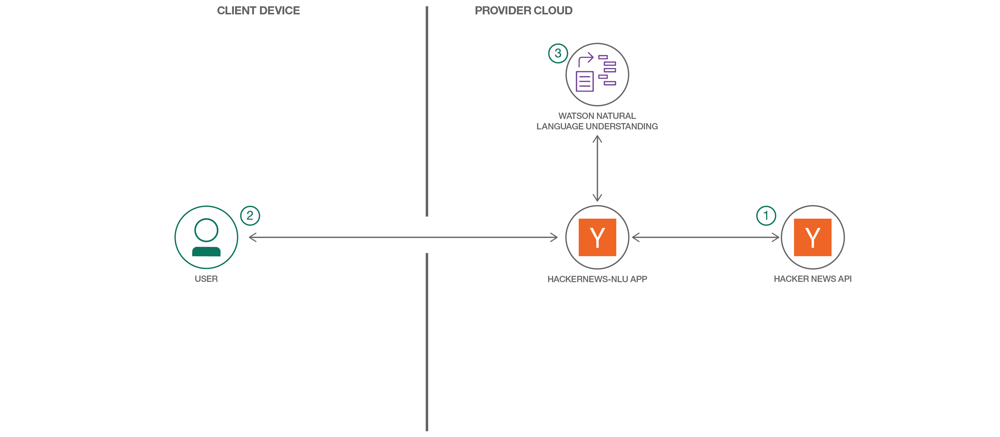

[](https://travis-ci.org/IBM/Hackernews-NLU)

# Use Swift to interpret unstructured data from Hacker News

This code pattern is a sample application that uses Watson Natural Language Understanding service to analyze the contents of trending news articles on Hackernews to give information about the concepts, entities, categories, keywords, sentiment, emotion etc. about the news article.

## Flow



1. The user deploys the application to IBM Cloud.
1. Application loads the data from the Hackernews API.
1. The user interacts with the application UI using their browser.
1. When the user performs any action, UI calls the server application API which uses the Watson NLU service to analyze the respective news article.

## Included Components

* [Watson Natural Language Understanding](https://www.ibm.com/watson/developercloud/natural-language-understanding.html): An IBM Cloud service that can analyze text to extract meta-data from content such as concepts, entities, keywords, categories, sentiment, emotion, relations, semantic roles, using natural language understanding.

## Featured Technologies

* [Artificial Intelligence](https://medium.com/ibm-data-science-experience): Artificial intelligence can be applied to disparate solution spaces to deliver disruptive technologies.

## Steps

### Deploying the Application to IBM Cloud

You can deploy the application by using the `Deploy to IBM Cloud` button or via the `IBM Cloud CLI`.

### Using the `Deploy to IBM Cloud` button

Clicking on the button below creates a IBM Cloud DevOps Toolchain and deploys this application to IBM Cloud. The [`manifest.yml`](manifest.yml) file included in the repo is parsed to obtain the name of the application, configuration details, and the list of services that should be provisioned.

[](https://cloud.ibm.com/devops/setup/deploy?repository=https://github.com/IBM/Hackernews-NLU)

Once deployment to IBM Cloud is completed, you can view the deployed application and services from your IBM Cloud account.

### Clone and push the application

You can also manually deploy the app to IBM Cloud. Though not as magical as using the IBM Cloud button above, manually deploying the app gives you some insights about what is happening behind the scenes. Remember that you'd need the IBM Cloud [command line](https://cloud.ibm.com/docs/cli/index.html) installed on your system to deploy the app to IBM Cloud.

#### 1. Clone the repo

Clone the `Hackernews-NLU` repository locally. In a terminal, run:

```bash
git clone https://github.com/IBM/Hackernews-NLU
```

#### 2. Create the NLU service

Create the following service through the IBM Cloud console:

* [**Watson Natural Language Understanding**](https://cloud.ibm.com/catalog/services/natural-language-understanding)

> **NOTE:** Ensure the service is named *HackernewsNLU*.

**OR**

* Create the NLU service with the CLI

```bash
bx service create natural-language-understanding free "HackernewsNLU"
```

Once the service is created, you can issue the `bx app push` command from the project's root folder to deploy the application to IBM Cloud.

```bash
$ bx app push
Invoking 'cf push'...

Pushing from manifest to org test@example.com / space dev as test@example.com...
Using manifest file /Users/stevemar/workspace/Hackernews-NLU/manifest.yml
Getting app info...
Creating app HackernewsNLU...
Mapping routes...
Binding services...
Comparing local files to remote cache...
Packaging files to upload...
Uploading files...

<truncated>

Waiting for app to start...
name:              HackernewsNLU
requested state:   started
instances:         1/1
usage:             256M x 1 instances
routes:            hackernewsnlu-rested-aligator.mybluemix.net
last uploaded:     Wed 08 Aug 17:30:12 EDT 2018
stack:             cflinuxfs2
buildpack:         swift_buildpack
start command:     HackernewsNLU

     state     since                  cpu    memory         disk           details
#0   running   2018-08-08T21:37:31Z   7.9%   5.4M of 256M   550.3M of 1G
```

Once the application is running on IBM Cloud, you can access your application assigned URL (i.e. route). To find the route, you can log on to your [IBM Cloud account](https://cloud.ibm.com), or you can inspect the output from the execution of the `bx app push` or `bx app show` commands. The string value shown next to the `urls` field contains the assigned route.  Use that route as the URL to access the sample server using the browser of your choice.

## Sample Output

By navigating to the running app you should see a web application that retrieves articles from HackerNews. Clicking on a specific article will generate a report that analyzes that article, showing concepts, categories, entities, keywords and other interesting concepts that were extracted from Watson's Natural Language Understanding APIs.

> List of HackerNews articles


> Individual analysis of a HackerNews article by Watson NLU


## Building the project locally

1. Clone the project

   ```
   git clone https://github.com/IBM/Hackernews-NLU
   ```

2. Build with the swift command line and launch with XCode

   ```
   swift package generate-xcodeproj
   open HackernewsNLU.xcodeproj
   ```

3. If you make any changes rebuild the project using the command below

   ```
   swift build
   ```

### Troubleshooting

Can't build the project? Check that your Swift version is up to date:

```
$ swift package tools-version
3.1.0
$ swift package tools-version --set-current
$ swift package tools-version
4.1.0
```

# Learn more

* **Artificial Intelligence Patterns:** Enjoyed this Pattern? Check out our other [AI Patterns](https://developer.ibm.com/technologies/artificial-intelligence/).
* **AI and Data Pattern Playlist:** Bookmark our [playlist](https://www.youtube.com/playlist?list=PLzUbsvIyrNfknNewObx5N7uGZ5FKH0Fde) with all of our Pattern videos
* **With Watson:** Want to take your Watson app to the next level? Looking to utilize Watson Brand assets? [Join the With Watson program](https://www.ibm.com/watson/with-watson/) to leverage exclusive brand, marketing, and tech resources to amplify and accelerate your Watson embedded commercial solution.

# License

This code pattern is licensed under the Apache Software License, Version 2.  Separate third party code objects invoked within this code pattern are licensed by their respective providers pursuant to their own separate licenses. Contributions are subject to the [Developer Certificate of Origin, Version 1.1 (DCO)](https://developercertificate.org/) and the [Apache Software License, Version 2](https://www.apache.org/licenses/LICENSE-2.0.txt).

[Apache Software License (ASL) FAQ](https://www.apache.org/foundation/license-faq.html#WhatDoesItMEAN)
